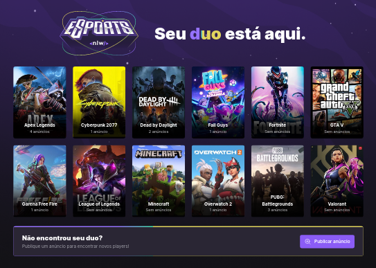
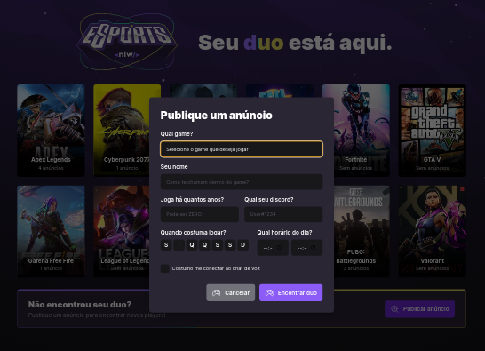
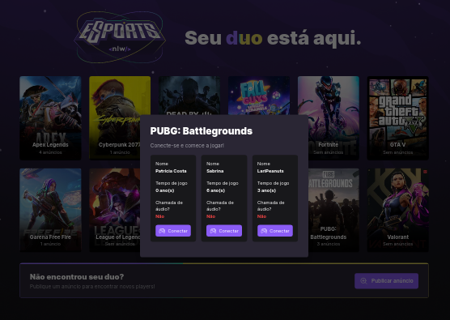
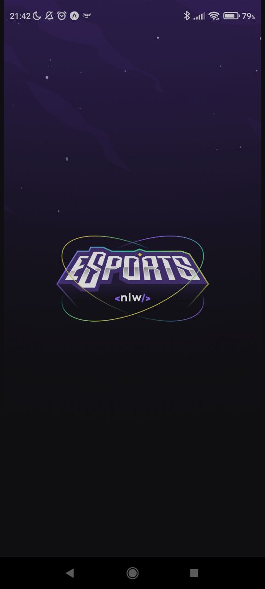
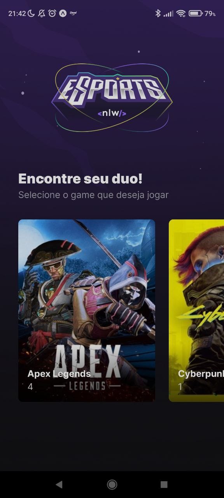
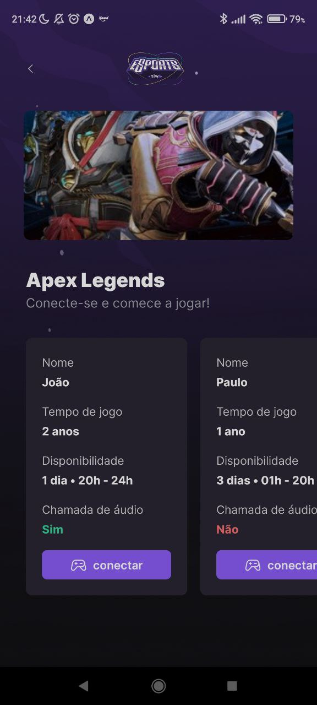
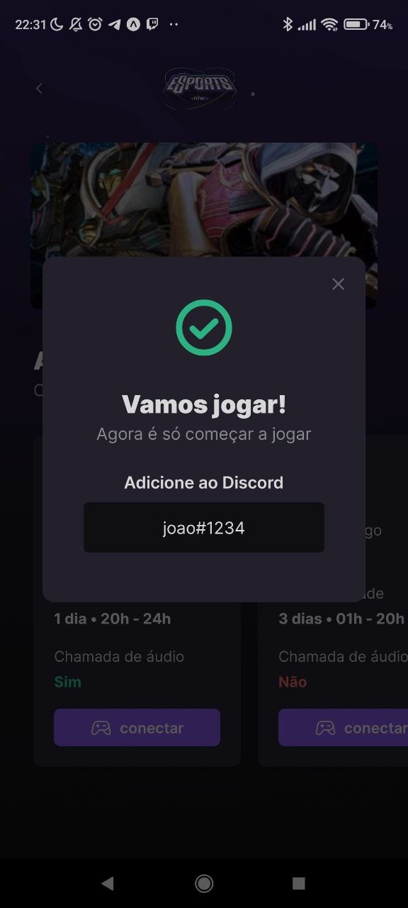
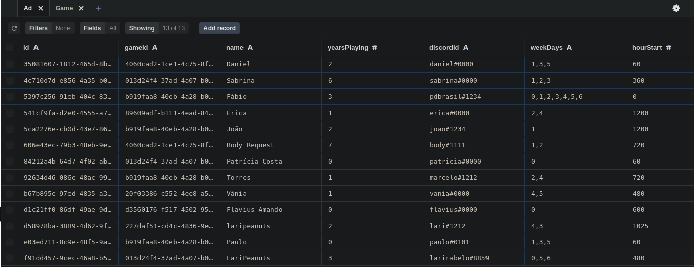
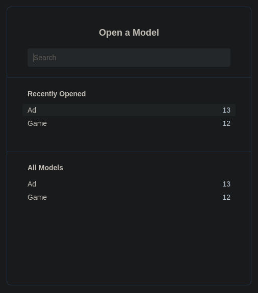

<div align="center">

  
  <h1>NWL - eSports</h1>
  <p>
    Rocketseat · Ignite Trail
  </p>

<!-- Badges -->
<p>

</p>

<!-- <h4>
    <a href="https://raro-academy-videos.vercel.app/" target="_blank" >Demo</a>
  <span> · </span>
    <a href="https://github.com/laripeanuts/raro-academy-videos/issues/new">Reporte Bug</a>
  <span> · </span>
    <a href="https://github.com/laripeanuts/raro-academy-videos/pulls/">Request Feature</a>
</h4> -->
</div>

<br />

## 💡 Project

eSports is a project developed during the Next Level Week, an event promoted by Rocketseat. The project consists of a website for an eSports company, where you can register player's availability to play, and also find friends to play with. [Files](https://efficient-sloth-d85.notion.site/Ignite-18c1174738e54f1d8e742f794e210cd2) and [Figma](https://www.figma.com/proto/FWRSplMx3BaVsQCHNWR9rH/NLW-eSports-(Community)?node-id=0%3A1).

<!-- [Versão em português](./README-ptbr.md) -->

## 🎯 Goals

Develop a project that applied the fundamental concepts of React, React Native, NodeJS and fulfilled the following requirements:

- [x] Develop with TypeScript
- [x] Integrate projects: Server, Mobile and Web
- [x] Follow the design [Figma](https://www.figma.com/proto/FWRSplMx3BaVsQCHNWR9rH/NLW-eSports-(Community)?node-id=0%3A1)

### Server

- [x] Create backend with NodeJS, SQLite, Prisma
- [x] Method GET to list all games on server
- [x] Method POST to create a new ad
- [x] Method GET to list all ads from one game
- [x] Method GET to get discord user id from a ads

### Mobile

- [x] Create mobile app with React Native, Expo
- [x] Show all games on home screen
- [x] Show ads from one game on game screen

### Web

- [x] Create web app with ReactJS and vite
- [x] Show a list of games with ads
- [x] Create a modal to add new ad

## 👩🏻‍💻 My additions

- [x] Page and File structures
- [x] Create a modal to each game showing the ads
- [x] Create a ad card component

## 🥳 Application

### Web

<p align="center">
  
  
  
</p>

### Mobile

<p align="center">
  
  
  
  
</p>

### Server

<p align="center">
  
  
</p>

## 💻 Made with

[](https://developer.mozilla.org/pt-BR/docs/Web/JavaScript)
[](https://www.typescriptlang.org/)
[](https://pt-br.reactjs.org/)
[](https://pt-br.reactjs.org/)
[](https://developer.mozilla.org/pt-BR/docs/Web/HTML)
[](https://developer.mozilla.org/pt-BR/docs/Web/CSS)

## 🛠️ Tools

[](https://code.visualstudio.com/)
[](https://pop.system76.com/)
[](https://pop.system76.com/)

## 🦸‍♂️ Support libs

- Phosphor (Icons)
- Radix UI (Modal)
- Express (Server)
- Prisma (ORM)
- Cors (CORS)
- SQLite (Database)
- Expo (Mobile)

## 🚀 How to run

Clone o projeto

```bash
  git clone https://github.com/laripeanuts/rocketseat-bootcamp-nwl-esports.git
```

Vá para a raiz do diretório

### Server


```bash
  cd /server
```

Instale as dependências

```bash
  pnpm install
```

Inicie o servidor local

```bash
  pnpm start
```

### Web


```bash
  cd /web
```

Instale as dependências

```bash
  pnpm install
```

Inicie localmente

```bash
  pnpm run dev
```
### Mobile


```bash
  cd /mobile
```

Instale as dependências

```bash
  yarn install
```

Inicie localmente

```bash
  expo start
```

<p align="center">Copyright © 2022 ☕<a href="https://github.com/laripeanuts">laripeanuts</a></p>
